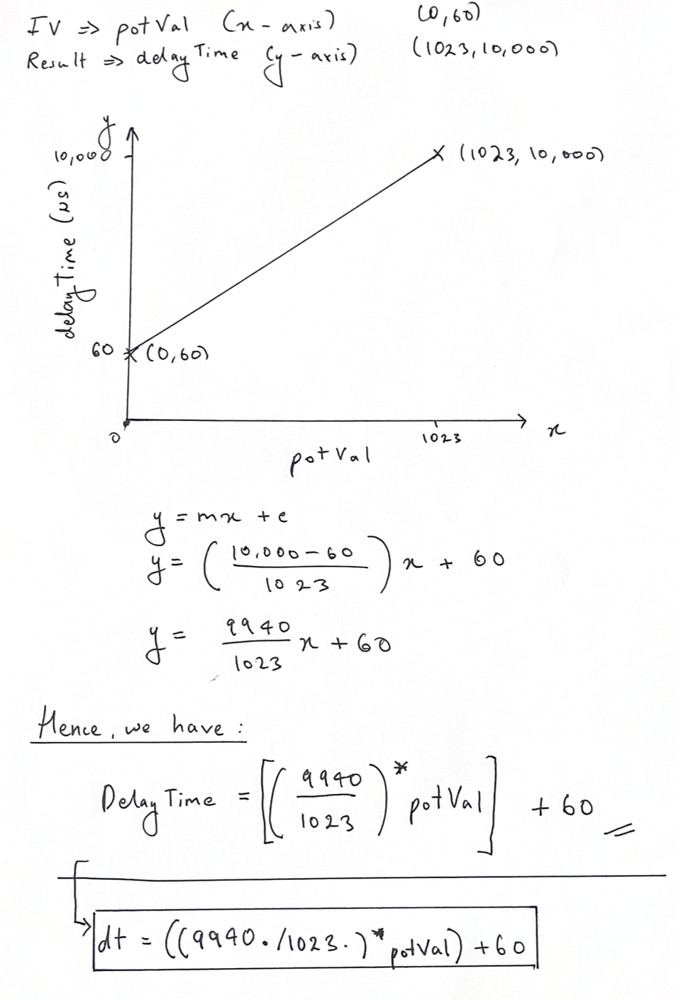
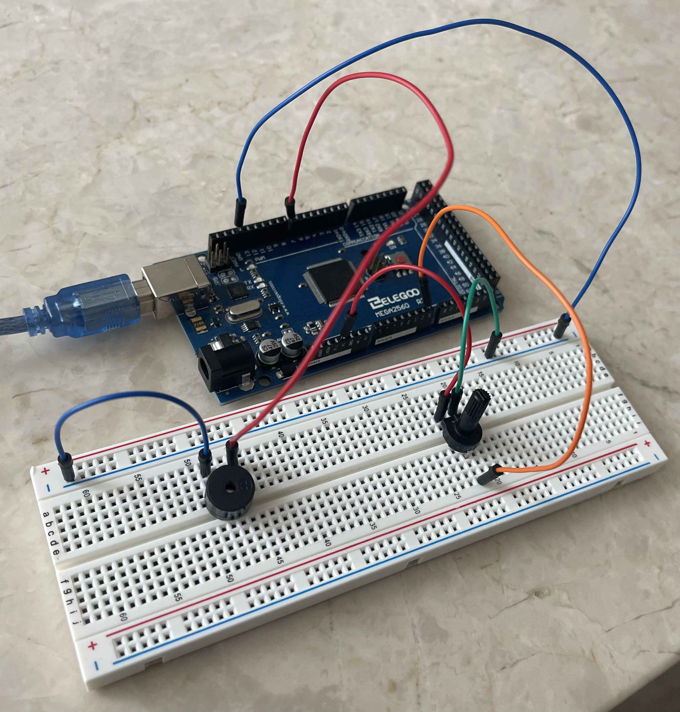

# Passive Buzzer Project

This project involved using a `passive buzzer` and a `potentiometer`, which was used to control the tone of the buzzer using a delay time. I modelled the function by hand and then used my formula to convert the `potVal` to a buzzer delay time. 

## Key Takeaways

- Modelling a function based on a given problem
- Using passive buzzers and potentiometers
- Remembering to use floats during calculations with potentiometers

## Images

<table align="center">
  <tr>
    <td align="center">
      
    </td>
    <td align="center">
      
    </td>
  </tr>
</table>
